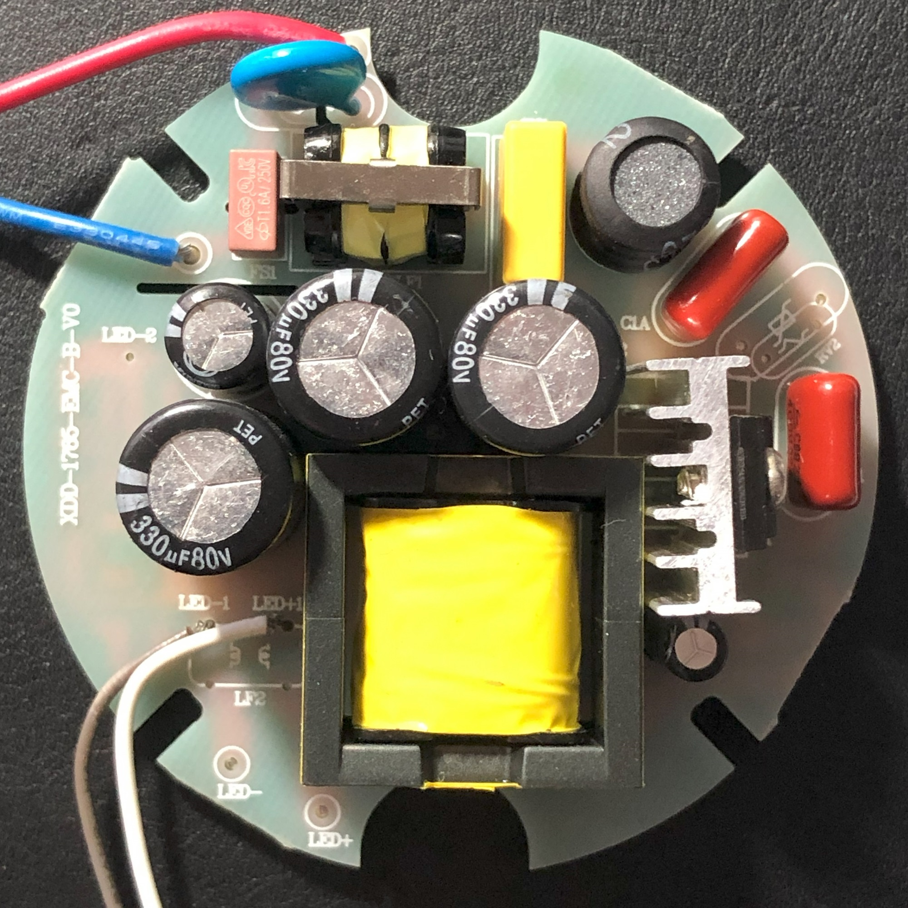
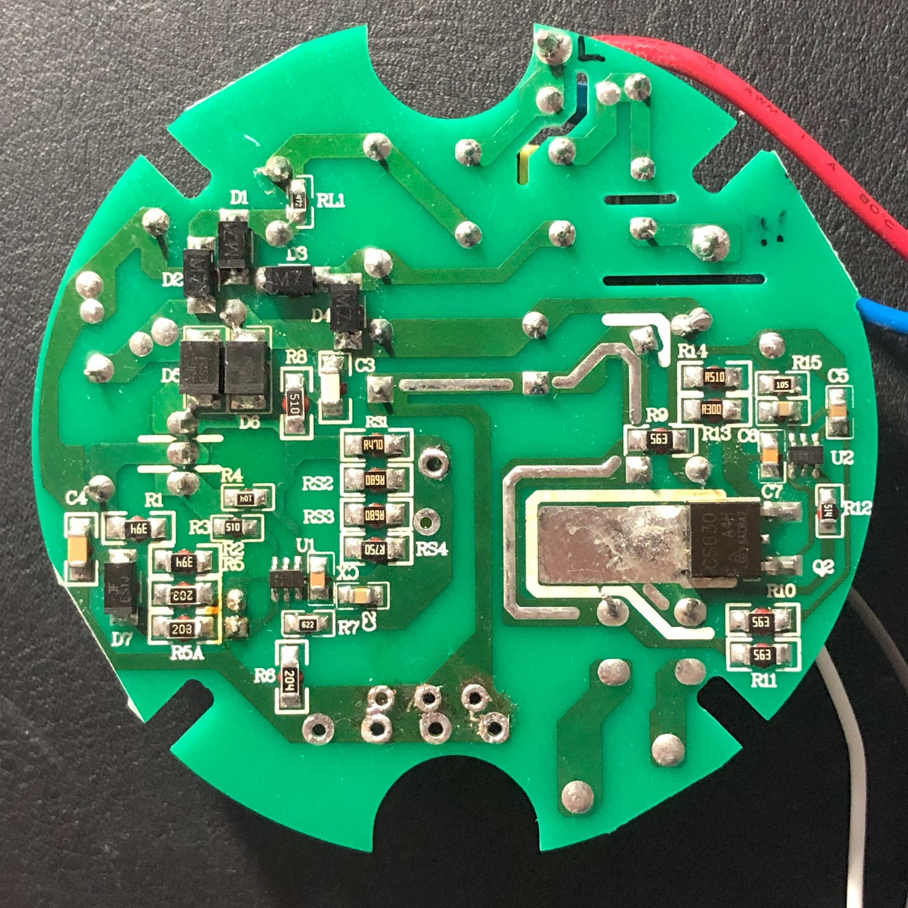
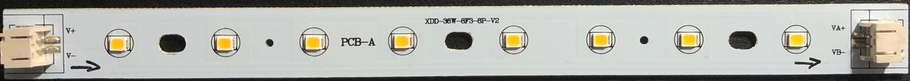
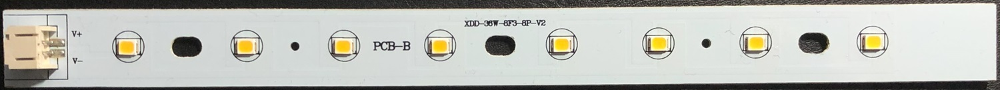

# LED driver RCL-A-36W

### General

This repo contains a re-engineered schematic of the RCL-A-36W LED driver as [KiCad][kicad] project

*__Note:__ The schematic is currently incomplete as there are some parts that I cannot identify at the moment. If you can help to identify these parts or find some errors in the circuit, please open an [Issue][issue].*

[kicad]: https://www.kicad.org/
[issue]: https://github.com/Blu3Squirr3l/LED-Driver_RCL-A-36W/issues/new/choose

### Purpose

My ceiling lamp in the bathroom started flickering after ~25 month and died some days later. Instead of throwing everything away, I created a schematic of the driver pcb to understand the function and support the repairing process, because a replacement LED driver seems to be very hard to find.

The lamp is an `EGLO 97879` ([FRANIA-S][vendor]).

[vendor]: https://www.eglo.com/de/wand-deckenleuchte-frania-s-97879.html

#### Properties of the driver

- Model: _RCL-A-36W_
- Power: _36W_
- Input: _220-240V~ 50/60Hz 172mA_
- Output: _54V DC 620mA_

#### Driver PCB

- top marking: `XDD-1765-EMC-B-V0`

#### LED PCBs

- top marking: `XDD-36W-8F3-8P-V2`
- 5x PCB-A (passthrough)
- 1x PCB-B (end of LED circuit)

